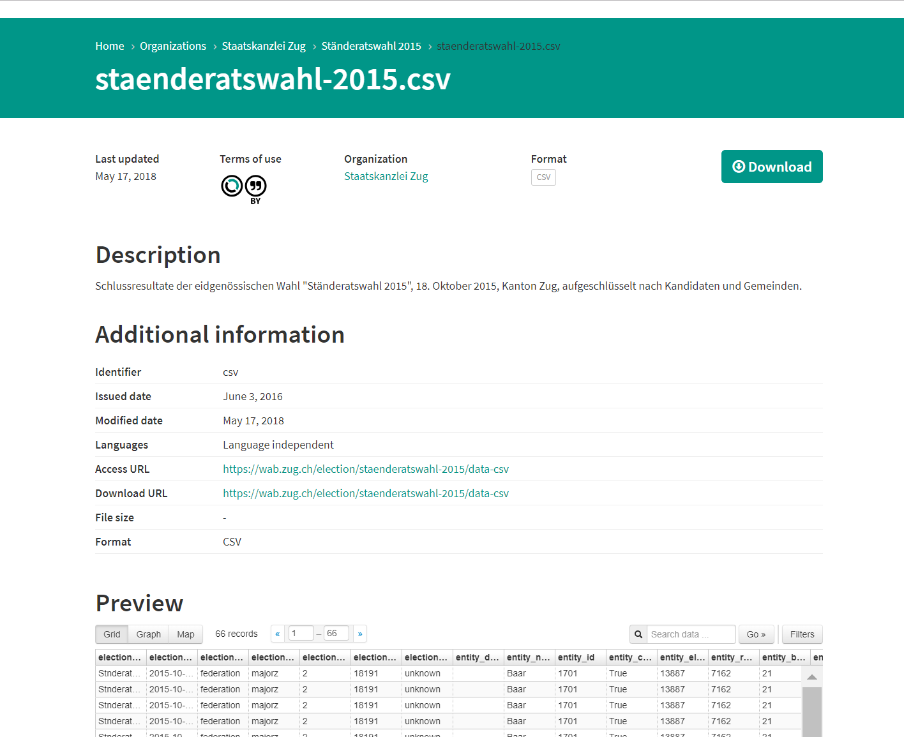

# Uploading metadata to opendata.swiss

This involves three steps:

1. Organizational and technical preparations by you as data supplier
2. Uploading to the opendata.swiss catalogue
3. Updated catalogue online at opendata.swiss.

The [user handbook](/en/library/opendataswiss-userguide) contains detailed information on the opendata.swiss system.

## Preparations

Assign roles:

- Define the data owner: who in your organization is responsible for the data and for publishing them?  
- Define the data supplier: who has technical responsibility? (tasks may include metadata entry, testing, updates)
- Define who assesses the quality of the descriptions and the metadata and who can answer technical/content questions on the data fonds.
- Define the single point of contact (SPOC) for the portal operator.

Prepare the data and metadata:

- Verify the reference to the [legal framework for publication](/en/prepare/frameworks).
- Check that the [correct terms of use](/en/prepare/terms) have been chosen.
- Check the format in which the datasets are to be published.

> ### Recommended data formats

> Essentially, you can make your data available on opendata.swiss in any data format you choose. However, the Federal Archives recommend using one of the formats listed in [Recommendations for OGD Formats](/en/library/empfehlungen-formate).

- If necessary, carry out a quality check of the data

#### MIME-Type Mapping
To retrieve the format that is displayed on the portal, following values will be checked in following order:

1. File Extension of `dcat:downloadURL`
2. Value of `dct:mediaType`
3. Value of `dct:format`

The value retrieved will be mapped as follows:

| Retrieved Value | Displayed Format |
|-------------|-----------|
| text, txt   | TXT       |
| html        | HTML      |
| csv         | CSV       |
| xml         | XML       |
| json        | JSON      |
| geojson     | GeoJSON   |
| xls, xlsx   | XLS       |
| zip         | ZIP       |
| pdf         | PDF       |
| wms         | WMS       |
| wcs         | WCS       |
| wfs         | WFS       |
| wmts        | WMTS      |
| kmz         | KMZ       |
| geotiff     | GeoTIFF   |
| tiff        | TIFF      |
| png         | PNG       |
| other values| N/A       |

## Resource Previews
Whenever possible, a preview of the data is displayed on each resource pages. This helps users to evaluate whether the dataset fits their need without having to download it first. 

If a preview is not possible, an error message appears after 5 seconds. 

### Supported Formats

* **Tabular Data**: see below
* **Text**: HTML, XML, JSON
* **Other**: PDF

### Restrictions

* File needs to be available
* The size of the file has to be smaller than 20MB

### Tabular data
The Xloader will always try to load tabular data into the DataStore. Ressources will be queued and then uploaded into DataStore asynchronously. Following requirements and restrictions apply:

* The format of the resource has to be one of:
	* csv
	* application/csv
	* xls
	* xlsx
	* tsv
	* application/vnd.ms-excel
	* application/vnd.openxmlformats-officedocument.spreadsheetml.sheet
	* ods
	* application/vnd.oasis.opendocument.spreadsheet
* Supported Delimiters: `,`
* The size of the file has to be smaller than 20MB
* Duplicate column-names are not supported
* Empty headers are not supported
* Invalid data is not supported, e.g. a numeric value that is out of range or that is inserted into a text field

If the Xloader fails, a second attempt via MessyTables will be started:
* messytables is more accepting and tries to guess types and can sometimes also import files with missing headers or empty columns

### Triggers for preview creation
* **Automatic**: when a dataset is updated (= updated via Harvester or Wordpress), all its resources are checked for changes. If all requirements are met (supported formats, file is available, etc.), the system tries to create views for all its resources 
* **Manual**: it's possible to submit all or some datasets to the system to try to create views, contact the support for help.

## Importing the metadata

Before you can import your metadata to opendata.swiss, the Federal Archives must enter your organization in the system. If your organization has not previously published data on the portal, please register by [contacting us](mailto:opendata@bar.admin.ch). You should then do the following:

- Familiarize yourself with the user interface and the DCAT-AP fields. Detailed information on the system can be found in the [opendata.swiss user handbook](/en/library/opendataswiss-userguide).
- Enter the metadata, completing the fields defined in the [DCAT-AP standard](/en/library/ch-dcat-ap) (this will depend on the [publication option](/en/publish/options) chosen).
- Send us an image and a description of your organization, if possible in four languages (DE, FR, IT, EN). These will be published on your organization’s page ([for example here](https://opendata.swiss/en/organization/schweizerisches-bundesarchiv-bar)).

## Data online

The Federal Archives and the data supplier together ensure that all the data, metadata and descriptions are displayed correctly in the test environment.

Once you have given your consent, the Federal Archives will make the data available online.

# Publication via geo.admin.ch

This chapter is [available in our library](/en/library/geodaten-publikation).
