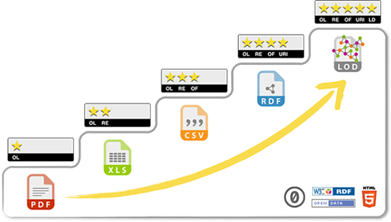
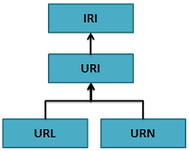
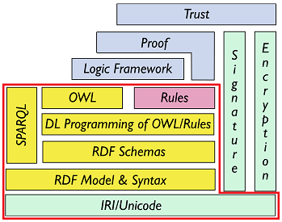
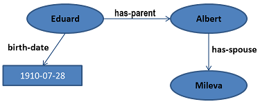
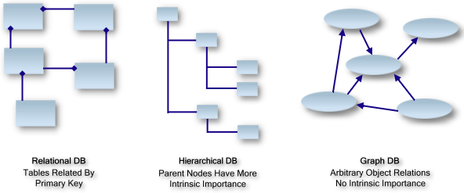
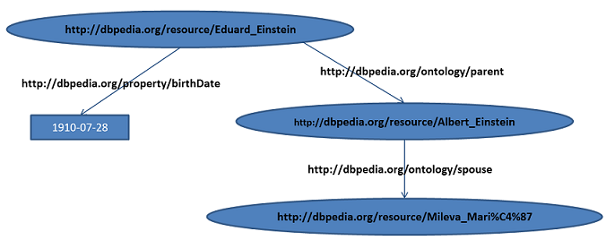

# **What is Linked Data ?**

Nowadays, we are surrounded by vast quantities of data. This data is playing an increasingly central role in our lives and driving the emergence of a data economy [^1]. However, the more data we have, the more we know the limitations of the traditional data organization methodologies. In fact, the traditional methods when it comes to publishing machine-friendly data (i.e. structured data, not text documents in natural language) is to generate raw data in files (e.g. CSV or spreadsheets), or provide data access through APIs. Even though those ways to make data available and accessible is already a huge step forward for data and knowledge sharing, there is still space for improvement to facilitate the reuse, such as:

* *comprehensibility*: provide better descriptions of the data and its underlying model (or schema)

* *accessibility and shareability*:  simplify the access to the data, and thus also facilitate the distribution of up-to-date data

* *integration*: facilitate the combination of data from different sources

The World Wide Web has enabled the creation of a global information space comprising linked documents. It has radically altered the way we share knowledge by lowering the barrier to publish and access documents as part of a global information space [^2]. Linked Data provides a publishing paradigm in which not only documents, but data itself can be a first class citizen of the Web (Scott, 2006), thereby enabling the extension of the Web with a global data space based on open standards - the Web of Data.

In summary, *Linked Data *is about publishing data *in* the Web and promoting links between data from different sources. It marks a shift in thinking from publishing data in human readable HTML documents to machine readable documents. Linked Data is a term used to describe a recommended best practice for exposing, sharing, and connecting pieces of data, information, and knowledge on the Web using URIs to identify things and describe them using a data model called the Resource Description Framework (RDF).

Tim Berners-Lee, inventor of the Web, laid down the four [design principles of Linked Data](https://www.w3.org/DesignIssues/LinkedData.html), providing a basic recipe for publishing and connecting data using the infrastructure of the Web while adhering to its architecture and standards:

* Use URIs (Uniform Resource Identifier) to name (identify) things. 
For instance "http://dbpedia.org/resource/Switzerland" was chosen to identify the country Switzerland in a data source called DBPedia. The well established Domain Names System (DNS) ensures that this key is unique worldwide.

* Use HTTP URIs so that these things can be looked up (interpreted, "dereferenced"). 
Retrieving a representation of a resource identified by a URI is known as *dereferencing* that URI. By choosing an URL as the key for the resource (a URL is an HTTP URI), we can follow the link to get information about that resource. For a user, it means that by clicking on the URL[ http://dbpedia.org/resource/Switzerland](http://dbpedia.org/resource/Switzerland), he will directly access the information rendered by a Web browser. Using the same underlying technology, a computer program could access the information and manipulate it, *the Web does become a Data Base.*

* Provide useful information about what a name identifies when it's looked up, using open standards (as the [RDF W3C standard](https://www.w3.org/TR/2014/NOTE-rdf11-primer-20140624/)) 
When you open that page in a browser (by dereferencing the URI), all the data presented to you comes from the underlying RDF data that is rendered here as standard HTML.
If you want to have a closer look at that RDF data, you can access it through[ http://dbpedia.org/data/Switzerland](http://dbpedia.org/data/Switzerland).

* Refer to other things using their HTTP URI-based names when publishing data on the Web. 
On Switzerland page of the DBPedia web site, you will find some related data from other data sources. For instance, look for the[ geodata:Suisse](http://sws.geonames.org/2658434/) string, and click on it. You will be directed to the page of the same entity, Switzerland, on another well known Linked Data source: geoNames. Thanks to the use of universal identifiers, those two different data sources were able to link their data, and the end-user can now find a broad range of information about Switzerland in either of those sources.

Be aware that those Web resources identified by a dereferenceable URIs are not meant to be directly viewed by end-users, but really serve as a distributed data base from which software developers will create richer applications and functionalities, with user-friendly interfaces.

A little word about the structure of the data and some basic terms related to Linked Data: RDF is a data model where each piece of information is a simple sentence made of three parts: a subject, a relation (or predicate), and an object, hence the name of *triple*. The relation is what allows the creation of connections amongst data (subjects and objects), in other words to *link the data*. With RDF a new kind of data base was created to store RDF triples, it is commonly called a *triple store*. To query the triples stored in a triple store, a query language was developed: *SPARQL*.  All of those new technologies are defined by W3C standards and will be described in little more details here under.

# **What are the benefits ?**

Linked Data is shareable, extensible, and easily re-usable. It supports multilingual functionality for data and user services, such as the labeling of concepts identified by URIs. By using globally unique identifiers to designate works, places, people, events, subjects, and other objects or concepts of interest, resources can be referenced across a broad range of sources and thus make integration of different information much more feasible. Linked Data breaks the information silos from various data formats and makes data integration and data mining over complex data easier. Moreover, those technologies also allow for easy updates and extensions of the data models as well as inferring new knowledge out of existing facts.

When talking more specifically about Open Data, Linked Open Data is given a 5 stars rating. Tim Berners-Lee proposed a rating system for Open Data as shown in Figure 1. To get the maximum five stars, data must (1) be available on the Web under an open license, (2) be in the form of structured data, (3) be in a non-proprietary file format, (4) use URIs as its identifiers, (5) include links to other data sources.

Figure 1. 5-Star Deployment Scheme for Open Data (source: [5stardata.info](http://5stardata.info))

To give a better understanding of the benefits and costs for each star, we regroup the explanations in the following table:

<table>
  <tr>
    <td colspan="2" align="center">5-star Deployment System for Open Data</td>
    <td colspan="2" align="center">Costs and Benefits</td>
  </tr>
  <tr>
    <td width="5%"></td>
    <td width="25%"></td>
    <td width="35%" align="center">As a consumer</td>
    <td width="35%" align="center">As a publisher</td>
  </tr>
  <tr>
    <td align="center"></td>
    <td>make your stuff available on the Web (whatever format) under an open license</td>
    <td>✔ You can look at it. 
✔ You can print it. 
✔ You can store it locally (on your hard disk or on an USB stick). 
✔ You can enter the data into any other system. 
✔ You can change the data as you wish. 
✔ You can share the data with anyone you like</td>
    <td>✔ It’s simple to publish. 
✔ You do not have to explain repeatedly to others that they can use your data.</td>
  </tr>
  <tr>
    <td align="center"> </td>
    <td>make it available as structured data (e.g., Excel instead of image scan of a table)</td>
    <td>You can do all what you can do with ★ Web data and additionally: 
✔ You can directly process it with proprietary software to aggregate it, perform calculations, visualise it, etc. 
✔ You can export it into another (structured) format.</td>
    <td>✔ It’s still simple to publish.</td>
  </tr>
  <tr>
    <td align="center">  </td>
    <td>make it available in a non-proprietary open format (e.g., CSV as well as of Excel)</td>
    <td>You can do all what you can do with ★★ Web data and additionally: 
✔ You can manipulate the data in any way you like, without the need to own any proprietary software package.</td>
    <td> You might need converters or plug-ins to export the data from the proprietary format. 
✔ It’s still rather simple to publish.</td>
  </tr>
  <tr>
    <td align="center">   </td>
    <td>use URIs to denote things,
so that people can point at your stuff</td>
    <td>You can do all what you can do with ★★★ Web data and additionally: 	
✔ You can link to it from any other place (on the Web or locally). 
✔ You can bookmark it. 
✔ You can reuse parts of the data. 
✔ You may be able to reuse existing tools and libraries, even if they only understand parts of the pattern the publisher used. 
 Understanding the structure of an RDF "Graph" of data can require more effort than tabular (Excel/CSV) or tree (XML/JSON) data. 
✔ You can combine the data safely with other data. URIs are a global scheme so if two things have the same URI then it’s intentional, and if so that’s well on it’s way to being 5-star data!</td>
    <td>✔ You have fine-granular control over the data items and can optimise their access (load balancing, caching, etc.) 
✔ Other data publishers can now link into your data, promoting it to 5 star! 
 You typically invest some time slicing and dicing your data. 
 You’ll need to assign URIs to data items and think about how to represent the data. 
 You need to either find existing patterns to reuse or create your own.</td>
  </tr>
  <tr>
    <td align="center">    </td>
    <td>link your data to other data to provide context</td>
    <td>You can do all what you can do with ★★★★ Web data and additionally: 	
✔ You can discover more (related) data while consuming the data. 
✔ You can directly learn about the data schema. 
 You now have to deal with broken data links, just like 404 errors in web pages. 
 Presenting data from an arbitrary link as fact is as risky as letting people include content from any website in your pages. Caution, trust and common sense are all still necessary.</td>
    <td>✔ You make your data discoverable. 
✔ You increase the value of your data. 
✔ Your own organisation will gain the same benefits from the links as the consumers. 
 You’ll need to invest resources to link your data to other data on the Web. 
 You may need to repair broken or incorrect links.</td>
  </tr>
</table>

## **Benefits of Linked Data in Library Environment**

As an example use-case, the [final report of the W3C sample applications of Linked Data in library environment](https://www.w3.org/2005/Incubator/lld/wiki/Benefits) explains the advantages of Linked Open Data which is by nature sharable, extensible, and easily re-usable.

1. Richer data, better data integration and reuse

Libraries assets will benefit from descriptions of a higher level of granularity, without requiring more investment. Linked Data enables different kinds of data about the same asset to be produced in a decentralized way by different actors. This is an alternative from the traditional approach where libraries have to produce stand-alone descriptions (as MARC records for instance). As a result data quality will be improved and this will help in the reduction of redundancy of metadata.

This is made possible by the use of Web-based identifiers which will also help in different areas, as facilitating navigation across library and non-library information resources, making up-to-date resource descriptions directly citable by catalogers, or enhance citation management software for instance.

2. Improved search possibilities and SEO

Information seekers benefit from improved federated search in new search applications, but also in existing search engines. Searching services will be richer, and libraries will improve their visibility through search engine optimization (SEO).

3. Long-lived meta-data

The history of information technology shows that specific data formats are ephemeral. Linked Data do not rely on a particular data structure and is thus more durable and robust than other metadata formats bound to a specific format.

4. Easier data access

Linked Data being published in the Web, accessing Linked Data is done in a uniform and trivial way consisting of HTTP requests. Data consumers do not need to learn different APIs or library-centric protocols.

5. Beneficiaries

Those benefits are presented for different actors of the library environment regrouped in four categories:

* researchers, students, and patrons

* organizations

* librarians, archivists, and curators

* developers and vendors

# **How to implement this approach?**

This section describes how the Linked Data approach could be implemented in the domain of Swiss Open Government Data. The proposed 10 steps are based on the W3C [Best Practices for Publishing Linked Data](https://www.w3.org/TR/ld-bp) document, adapted to the opendata.swiss context. Only the methodological guidelines of each step are presented here. For further details, please refer to the original document.

Table of content

1. Prepare Stakeholders

The first step to successfully create a Linked Open Data publishing process starts by explaining to stakeholders the conceptual Linked Data approach and the main technical differences compared to other Open Data publication solutions (the 5 stars Open Data is a good resource here). Then a data modeling life cycle can be designed based on the following steps presented here or adapting existing workflows.

2.	Select a Dataset

In the public administration context, the first barrier to publish data as "open data" is to have a legal basis allowing it. We thus propose to start with an already published dataset for which the legal basis question is already solved. It could be either:

* An Excel document that is already made available on one of the web pages of your organisation

* A database whose content is already available through a website, meaning that its content can be searched by a user but not by a machine (lack of API)

* Data sets published in reports (tables) that could have an added value to be published as row data on the web.

* Open Data not yet published: this would be a rare but very valuable case, where a newly open dataset is not published in any form yet

Moreover, preference can be given to:

* Data based on international or national standards (eCH standards for instance)

* Popular data or data with a high re-use potential

* Data that can be easily combined with other open data, and thus provide greater value

3.	Model the Data

The particularity of Linked Data modeling is that it consists of a transformation: from the original data (relational database, CSV files, etc.) to the RDF model. Defining this target data model is the objective of this step. This can be only achieved by bringing together domain-specific competencies hold by the data owner and linked data competencies that must usually be hired somewhere else.

The domain expert will explain the objects and their relationship (local relationship but also relationships to other data sources) as well as the standard vocabularies of the domain. The linked data expert will then look for existing RDF versions of those vocabularies (aka ontologies), and eventually define a new RDF vocabulary if needed.

4.	Specify appropriate terms of use and legal basis

The appropriate terms of use and legal basis should be explicitly defined along with the dataset, in accordance with the model defined in [Terms of use](https://opendata.swiss/en/terms-of-use) for OpenData.swiss.

5.	The Role of "Good URIs" for Linked Data

URIs are at the core of the Linked Data architecture, as they provide world wide identifiers that promote a large scale "network effects". They identify  the vocabularies (ontologies), the datasets themselves, the objects (resources) they contains as well as their relationships.

The original document from W3C provides [useful guidelines](https://www.w3.org/TR/ld-bp/#HTTP-URIS) about:

* URI Design Principles 
Provide dereferenceable HTTP URIs (URL) that serve as machine-readable representation of the identified resource. Define a URI structure that will last as long as possible by not containing anything that could change.

* URI Policy for Persistence 
Define a persistent URI policy and implementation plan, which relies on the commitment from the URI owner.

* URI Construction 
Includes guidance coming from URI strategies applied successful by different organizations

* Internationalized Resource Identifiers (IRI) 
If necessary, the use of Unicode characters (non-ASCII characters) is possible as long as it follows existing standards.

To clarify the notion of URL, URI and IRI:

Figure 2. A URL is a specific kind of URI, a URI is a specific kind of IRI

A URL is a specific kind of URI that is also a location as it is an HTTP URI and can be looked-up on the Web. In comparison, a URN is a Uniform Resource Name as an ISBN code for example.

For more details about how to design persistent URIs, please refer to the original [URI Construction](https://www.w3.org/TR/ld-bp/#HTTP-URIS) section which cites references to different documents. We would like to point out that the [Study on persistent URIs](http://philarcher.org/diary/2013/uripersistence/) is a nice Web representation of the very complete [10 Rules for Persistent URIs](https://joinup.ec.europa.eu/community/semic/document/10-rules-persistent-uris), which is the result of a survey done by the SEMIC working group for the European Commission.

6.	Standard Vocabularies

To facilitate the reuse of the data, reuse of standard vocabularies is a key factor as end-users will need to understand a dataset’s structure to quickly comprehend and assess it.

Standard vocabularies for Linked Data have been developed, validated and made available, as for instance:

* [data catalogs](http://www.w3.org/TR/vocab-dcat/)

* [organizations](http://www.w3.org/TR/vocab-org/)

* [multidimensional data](http://www.w3.org/TR/vocab-data-cube/)

Existing vocabularies can be found using search tools ([Falcons](http://ws.nju.edu.cn/falcons/),[ Watson](http://watson.kmi.open.ac.uk/WatsonWUI/),[ Swoogle](http://swoogle.umbc.edu/)) or directories ([LOV](http://lov.okfn.org/), the European Commission's[ Joinup platform](https://joinup.ec.europa.eu/catalogue/repository), or domain specific portals as the  [Bioportal](http://bioportal.bioontology.org/)  for the biological domain as an example). To evaluate a vocabulary, take into account if that vocabulary is published by a trusted group, is well documented and self-descriptive, is used by other datasets,  has persistent URIs and is accessible for a long period, and if its provides a versioning policy. If there is a need for a new vocabulary we recommend to contact an ontology expert to fulfill this task properly.

7.	Convert Data to Linked Data

Once all the former preparation steps have been carried out, it is possible to perform the data conversion from the original format to Linked Data (RDF triples). There are many ways to do this using existing tools available for that mapping operation, see the [W3C list](https://www.w3.org/wiki/ConverterToRdf) for instance. The Linked Data expert will know which tool to use for the purpose and, if needed, will create a new one.

This step should include the generation of metadata for that datasets (see the official documentation about [DCAT-AP for Switzerland](/en/library/ch-dcat-ap)), and also the links to other datasets, as for instance DBPedia (the Linked Data version of Wikipedia), to make the new dataset part of the [Linked Data Cloud](http://lod-cloud.net/).

8.	Provide Machine Access to Data

Different methods can be used to provide data access for machines, as:

* Direct URI resolution

* a[ RESTful API](http://www.w3.org/TR/ld-glossary/#rest-api), a[ SPARQL endpoint](http://www.w3.org/TR/ld-glossary/#sparql-endpoint)

* via file download

The SPARQL Protocol and RDF Query Language (SPARQL) is the standard query language for RDF. The current version, SPARQL 1.1, is defined by a [W3C recommandation](https://www.w3.org/TR/sparql11-overview/).

It is common practice for Linked Data to provide a service that accepts SPARQL queries: a SPARQL endpoint. The endpoint returns data in the requested format as XML or JSON for instance.  

We give further information about this in the [technical section](#Data-Access-Triple-store-and-SPARQL).

9.	Announce to the Public

One straight-forward channel for announcing the availability of a new dataset in Linked Data is to [publish a reference to it](en/category/publish) on opendata.swiss.

10.	Social Contract of a Linked Data Publisher

Linked Data publishers implicitly promise to guarantee the published datasets availability according to the predefined URI strategy, as if signing a "social contract" with the end-users.

This should be done in order to prevent third party applications to break when encountering an HTTP 404 "Not Found" error while accessing the data.

# **Technical information about Linked Data**

The technical structure underlying the principles of Linked Data was defined in the following  well-known layercake:

Figure 3. The layer cake for RDF technologies ([source](https://www.w3.org/Consortium/Offices/Presentations/Overview/#(40)))

This layercake has evolved through time, while the standards and tools were developed and tested. Here is an introduction to the main technical bricks (highlighted in red here above):

* unambiguous names for resources (for everything) : IRIs (URIs, URLs)

* a common data model to describe the resources: RDF

* schema for the data based on RDF (common vocabularies, ontologies) : RDFS, OWL, SKOS

* a query language for RDF: SPARQL

* reasoning logics: OWL, Rules (RIF)

## **Resource Description Framework (RDF)**

Linked Data is based on the Resource Description Framework (RDF, [a W3C standard](https://www.w3.org/TR/rdf-primer/)), a framework to represent information in the Web,  expressing information about any resource (people, things, anything).

RDF is a data model for "things" (resources) and their “relations”, where each piece of information is an RDF Statement (or RDF Triple) of the following structure:

    <subject> <predicate> <object>

Such a statement composed of three elements describes how a resource (the **subject**) is linked by a property (the **predicate**) to another resource or a value (the **object**)

Example of triples:

    <Eduard> <has-parent> <Albert>
    <Albert> <has-spouse> <Mileva>
    <Eduard> <birth-date> "1910-07-28"

Each triple can be represented visually as for instance:

Figure 4. RDF triple

As we can see, an RDF triple forms a graph where the subjects and objects make up the nodes and the predicates form the arcs.

Here is a visual representation of the few triples here above:

Figure 5. RDF Graph

RDF data, and thus Linked Data, form a Graph Database, which is different from the more common Relational or Hierarchical Databases:

Figure 6. Three different types of databases ([source](http://www.linkeddatatools.com/introducing-rdf))

So where do IRIs, the foundation of the layercake, come into play ? Everywhere! Everything is identified by a URL (a specific form of IRI), except literal values, as "1910-07-28" in our running example. We did not mention any URL in the former presentations to make things simple and more readable.

Each resource is a URL, for example:

    <Albert> -> <http://dbpedia.org/resource/Albert_Einstein>
    <Eduard> -> <http://dbpedia.org/resource/Eduard_Einstein>

Each property is also a resource, and so:

    <has-parent> -> <http://dbpedia.org/ontology/parent>
    <has-spouse> -> <http://dbpedia.org/ontology/spouse>

Here is the real RDF graph, with fully qualified URIs:

Figure 7. RDF graph with fully qualified URIs

RDF documents

There exist different specifications to write a RDF Graph (i.e. RDF Triples) to a file. This process is called "serialization" and the RDF 1.1 Primer gives the following list:

* [TURTLE](https://www.w3.org/TR/2014/NOTE-rdf11-primer-20140225/#bib-TURTLE) and [TRIG](https://www.w3.org/TR/2014/NOTE-rdf11-primer-20140225/#bib-TRIG)

* [JSON-LD](https://www.w3.org/TR/2014/NOTE-rdf11-primer-20140225/#bib-JSON-LD) (JSON based)

* [RDFa](https://www.w3.org/TR/2014/NOTE-rdf11-primer-20140225/#bib-RDFA-PRIMER) (for HTML embedding)

* [N-Triples](https://www.w3.org/TR/2014/NOTE-rdf11-primer-20140225/#bib-N-TRIPLES) and [N-Quads](https://www.w3.org/TR/2014/NOTE-rdf11-primer-20140225/#bib-N-QUADS) (line-based exchange formats)

* [RDF/XML](https://www.w3.org/TR/2014/NOTE-rdf11-primer-20140225/#bib-RDF11-XML) (the original 2004 syntax, updated for RDF 1.1)

The most common ones in 2016 are:

* Turtle to write down RDF Triples in a text file that will have a ".ttl" extension (a format that is easily readable by a human and thus prefered to the RDF/XML version)

* JSON-LD to store RDF data in java objects, which is a popular and practical format for computer programmers

* RDFa to add RDF inside HTML pages, the RDF data being not visible to end-users but at disposal for crawlers.

Turtle is a pretty simple format where each triple is written down. Our running example can be serialized in Turtle as follow:

    <http://dbpedia.org/resource/Eduard_Einstein> <http://dbpedia.org/ontology/parent> <http://dbpedia.org/resource/Albert_Einstein> .
    <http://dbpedia.org/resource/Albert_Einstein> <http://dbpedia.org/ontology/spouse> <http://dbpedia.org/resource/Mileva_Mari%C4%87> .
    <http://dbpedia.org/resource/Eduard_Einstein> <http://dbpedia.org/property/birthDate> "1910-07-28"^^<http://www.w3.org/2001/XMLSchema#date> .

In practice, some syntaxe shortcuts will be used and the final document will rather look like:

    @prefix dbo: <http://dbpedia.org/ontology/>
    @prefix dbp: <http://dbpedia.org/property/>
    @prefix dbr: <http://dbpedia.org/resource/>
    @prefix xsd: <http://www.w3.org/2001/XMLSchema#>

    dbr:Eduard_Einstein dbo:parent dbr:Albert_Einstein ;
    dbp:birthDate "1910-07-28"^^xsd:date .
    dbr:Albert_Einstein dbo:spouse dbr:Mileva_Mari%C4%87 .

## **Ontologies, RDFs and OWL**

RDF was designed to represent data in a machine-friendly way, but we are still missing an important part of Information Modeling: a Data Model or Schema. In term of Linked Data and RDF, the data model is called a "vocabulary" or “ontology”. For that purpose, RDF has been extended by [RDFSchema (RDFs)](https://www.w3.org/TR/rdf-schema/) and the [Ontology Web Language (OWL)](https://www.w3.org/TR/owl2-overview/). This is also where semantics is added to RDF.

RDFs allows to define Classes and Properties. Classes are used to group similar resources together by giving one or more types to a resource. In our example above, Albert, Eduard and Mileva are instances of a class Person. RDFs can be used to add some semantics to the property "spouse" for instance, by saying that the object and subject of this property are instances of the class Person. This information could serve for further checking or reasoning.

OWL goes one step further to define logical axioms and rules that can be further used by an inference engine to deduce new facts out of implicit knowledge. As a simple example, the "spouse" property can be defined as “symmetric”, in which case an inference engine would deduce from the triple “<Albert> <has-spouse> <Milena>” a new triple “<Milena> <has-spouse> <Albert>”. Without that inference, querying for the spouse of Milena would give no result.

The RDF data model is thus a common language for the schema and the data as well.

## **Data Access - Triple store and SPARQL**

As described in the W3C’s "Best Practices for Publishing Linked Data", there are different ways to provide machine access to data, and thus different ways for a end-user to access the data.

We will conclude with our example by showing how an end-user can access or query that data which comes from the DBPedia site.

* Direct URI resolution:
Any of the mentioned resource can be dereferenced, by simply clicking on one of the following URLs: 
[http://dbpedia.org/resource/Albert_Einstein
](http://dbpedia.org/resource/Albert_Einstein) [http://dbpedia.org/resource/Eduard_Einstein
](http://dbpedia.org/resource/Eduard_Einstein) [http://dbpedia.org/ontology/parent
](http://dbpedia.org/ontology/parent) [http://dbpedia.org/ontology/spouse](http://dbpedia.org/ontology/spouse)

* File download:
DBPedia datasets are available for download from [this page](http://wiki.dbpedia.org/datasets)

* SPARQL endpoint:
The databases for RDF  are called Triple Stores, a specific kind of Graph Databases. RDF data in a triple store can be exposed for direct querying through a SPARQL endpoint.
The SPARQL endpoint for DBPedia can be accessed [here](https://dbpedia.org/sparql)  
To give it a try, please copy/paste the following SPARQL query to ask for the spouse(s) of Albert Einstein (note that the SPARQL syntax is similar to the Turtle format), and hit the "run query" button to see the results:  
    `SELECT * {dbr:Albert_Einstein dbo:spouse ?spouse}`  
Or just click[ here](https://dbpedia.org/sparql?default-graph-uri=http%3A%2F%2Fdbpedia.org&query=select+*+%7Bdbr%3AAlbert_Einstein+dbo%3Aspouse+%3Fspouse%7D&format=text%2Fhtml&CXML_redir_for_subjs=121&CXML_redir_for_hrefs=&timeout=30000&debug=on).  
You can find [here](http://sparqles.ai.wu.ac.at/) a list of SPARQL endpoints and their status published by the Open Knowledge Foundation.  

## **Some more resources**

Here are some more resources helpful to work with Linked Data.

A W3C generic [list of tools](https://www.w3.org/wiki/Main_Page).

Programming

* [List of libraries for different programming languages](https://www.w3.org/2001/sw/wiki/Tools)

* [A Semantic Web Primer for Object-Oriented Software Developers](https://www.w3.org/TR/2006/NOTE-sw-oosd-primer-20060309/) (2006):

RDF Data

* [The Linking Open Data cloud diagram](http://lod-cloud.net/)

RDF Converters

* [W3C list of converters to RDF](https://www.w3.org/wiki/ConverterToRdf)

RDF Validators

* [W3C validator](https://www.w3.org/RDF/Validator/)

SPARQL Tutorials

* [Tutorial from LinkedDataTools](http://www.linkeddatatools.com/querying-semantic-data)

* [Tutorial from Euclid](http://euclid-project.eu/modules/chapter2.html)

* [Video introduction](https://www.youtube.com/watch?v=FvGndkpa4K0) from Bob Ducharme (11 min.):

* Cambridge Semantics: [Sparql by example](http://www.cambridgesemantics.com/semantic-university/sparql-by-example)

* [A tutorial](http://corese.inria.fr/srv/tutorial/sparql) by running/completing queries, from the Coreses Project (INRIA):

* [From SQL to SPARQL](http://www.slideshare.net/grecognos/from-sql-to-sparql)

* Wikidata [page with examples](https://www.wikidata.org/wiki/Wikidata:SPARQL_query_service) and some prepared queries on the [SPARQL endpoint](https://query.wikidata.org)

* [UniProt SPARQL Endpoint with examples](http://sparql.uniprot.org/sparql)

SPARQL Endpoints

* [SPARQL EndPoints status](http://sparqles.ai.wu.ac.at/availability)

* [W3C list](https://www.w3.org/wiki/SparqlEndpoints) (but many entries seems invalid now)

SPARQL validators

* [http://sparql.org/query-validator.html](http://sparql.org/query-validator.html)

* [http://sws.ifi.uio.no/sparqler/validator.html](http://sws.ifi.uio.no/sparqler/validator.html)

Triple Stores

* A [W3C list of large triple stores](https://www.w3.org/wiki/LargeTripleStores)

# **Glossary**

W3C maintains a pretty complete [glossary for Linked Data](https://www.w3.org/TR/ld-glossary/)

# **References**

[^1] Jim Ericson. Net expectations - what a web data service economy implies for business. Information Management Magazine, Jan/Feb, 2010.

[^2] Tom Heath and Christian Bizer (2011) Linked Data: Evolving the Web into a Global Data Space (1st edition). Synthesis Lectures on the Semantic Web: Theory and Technology, 1:1, 1-136. Morgan & Claypool.

